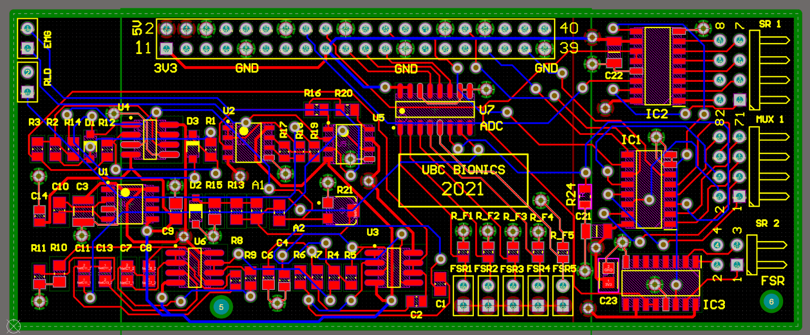

# bionics_electrical-embedded
UBC Bionics is an engineering student design team that competes in biomedical competitions, such as Cybathlon hosted by ETH Zurich. GRASP is our pilot project, a smart prosthetic arm integrating electromyography (EMG), computer vision, and 3D printing techniques, designed for a trans-radial forearm amputee.

  

 

Our current design features a variety of functionalities including the following features:

- Analysis of EMG data to control the hands (Analytics)
- Grip optimization that utilizes a camera on-board the arm for object recognition (Analytics)
- Integration with machine learning (Analytics)
- Translation of EMG signals into mechanical motion (Embedded)
- Design core framework that interfaces with outputs provided by electrical and analytical subteams (Embedded)
- Implementation of signal processing (Rust and Python)
- Improved finger actuation to optimize physical grips (Mechanical)
- Use of ergonomic shoulder brace for minimized load (Mechanical)
- Integration of wrist rotation and passive locking mechanism (Mechanical)
 

I would like to introduce the electrical/embedded subteam as I am part of the team.

### bionic arm hardware done by electrical subteam

  

  

 

### Electrical subteam infrastructure

  

  

 

### circuitry work and PCB design

  

  

  

 

I joined UBC Bionics near the Cybathlon 2024 competition period. As a new electrical engineer to the team, I’ve been involved in making a new, improved approach to preparing our next competition. Since October 2024, my work has mostly been research-based. I’ve been in charge of deciding and building a new motor system for our bionic arm to demonstrate high performance. 
 
 
My new role in 2025 is focused on haptics while dealing with sensors of the arm. (Haptics is a technology that transmits tactile information using sensations such as vibration, touch, and force feedback.) To efficiently perform the tasks, I act as a main bridge member between mechanical and electrical/embedded subteams. Additionally, PCB designs will be done for the general practice during my time on the electrical subteam.
